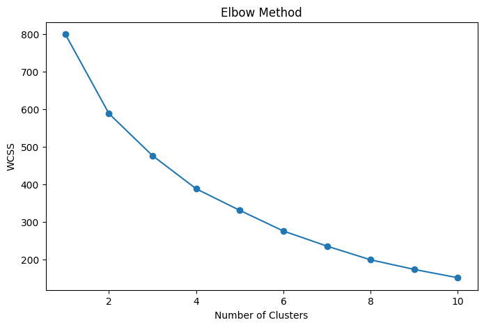
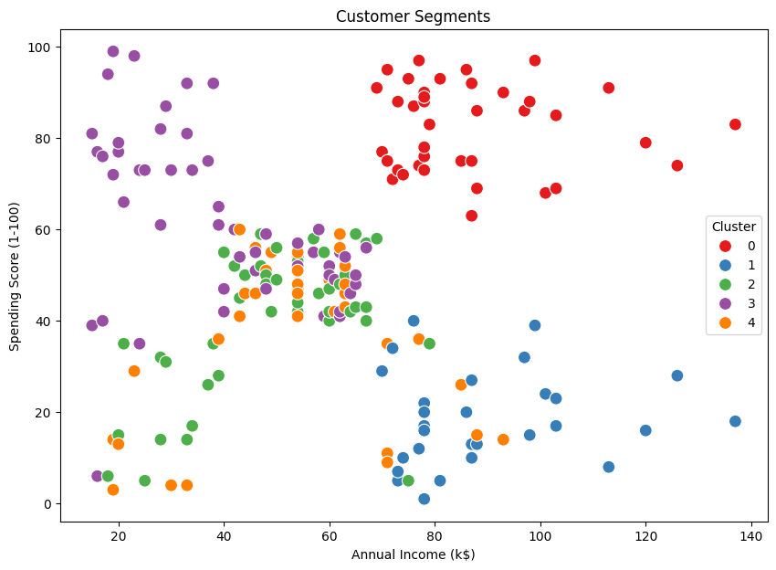
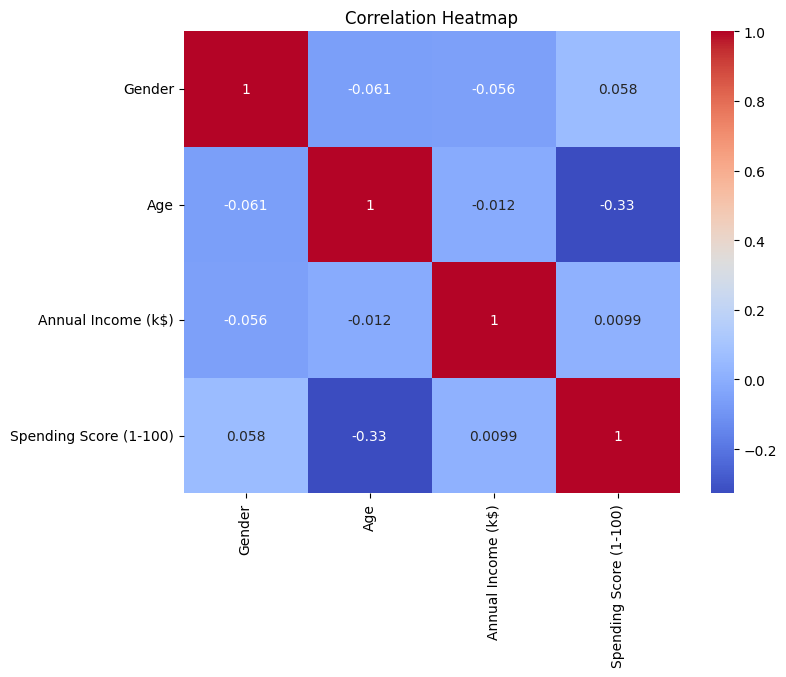

Customer Segmentation Analysis (K-Means Clustering)

Project Overview
This project analyzes customer purchasing behavior using clustering techniques to identify distinct customer segments based on income and spending patterns.

The objective was to transform raw customer data into meaningful segments that can support targeted marketing strategies using machine learning.

This project was completed as part of my Data Science Internship at Synent Technologies.

Business Problem
Businesses often struggle to understand different types of customers and their spending behavior.

This project aims to answer key business questions:

How can customers be grouped based on spending behavior?
Which customer segments have high spending potential?
How does income relate to spending patterns?
What marketing strategies can be applied to each segment?
Dataset
Dataset: Mall Customers Dataset

The dataset contains customer demographic and behavioral data including:

Customer ID
Gender
Age
Annual Income
Spending Score

Dataset Size:

200 records
5 columns

Tools & Technologies
Python
Pandas
NumPy
Matplotlib
Seaborn
Scikit-learn
Jupyter Notebook

Project Workflow
1. Data Loading & Inspection
Imported dataset
Checked data structure and data types
Identified key features for clustering

2. Data Cleaning
Checked for missing values
Verified data consistency
Selected relevant features for clustering

3. Exploratory Data Analysis (EDA)
Performed analysis on:

Income distribution
Spending score distribution
Relationship between income and spending
Customer behavior patterns

4. Model Building (K-Means Clustering)
Applied K-Means clustering algorithm
Used Elbow Method to determine optimal number of clusters
Assigned cluster labels to customers

5. Data Visualization
Created visualizations to identify:

Customer segments
Cluster distribution
Income vs Spending patterns

6. Business Insights
Generated actionable insights based on customer segmentation results

Key Findings
Key Results
Total records analyzed: 200

Identified 5 distinct customer segments

Clear separation between high and low spending groups

Spending behavior is not strongly dependent on income alone

Customer segmentation provides actionable marketing insights

Project Results
Analyzed 200 customer records

Identified 5 meaningful customer segments

Discovered high-income low-spenders and high-income high-spenders

Found distinct behavioral groups useful for targeted marketing

Visualizations
These visualizations helped identify meaningful customer patterns for targeted marketing strategies.

1. Elbow Method (Optimal Clusters)
Helps determine the best number of clusters for K-Means.

3. Customer Segments (Clustering Result)
Shows how customers are grouped based on spending behavior.

3. Correlation Heatmap
Displays relationships between numerical features like income and spending score.

Future Improvements
Future enhancements could include:

Hierarchical Clustering comparison
Customer Lifetime Value prediction
Recommendation system for personalized offers
Integration with dashboard (Streamlit or Power BI)
Real-time customer segmentation system

Author
Cwenga Ndzendze

Data Science Intern at Synent Technologies
Python | Machine Learning | Data Analytics | Visualization
